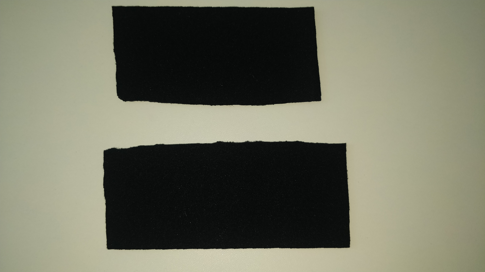
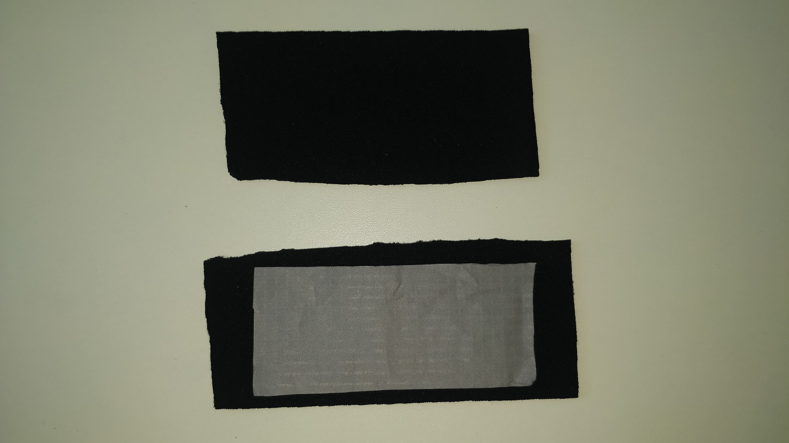
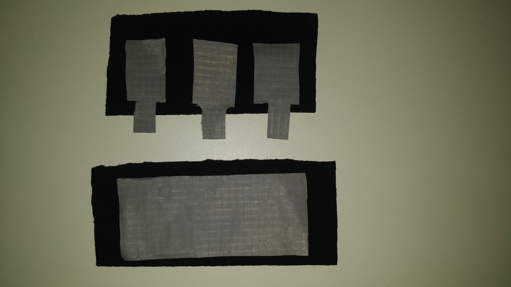
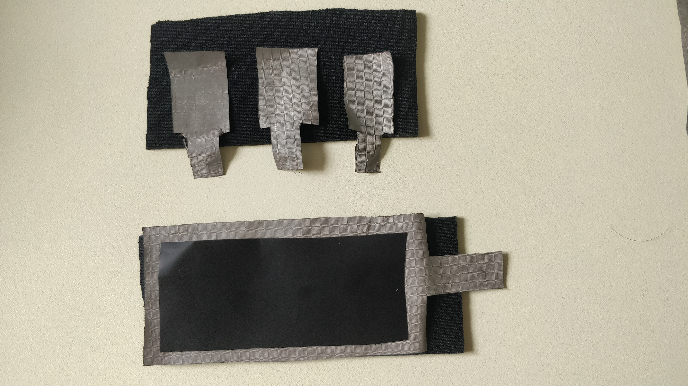

# MultipleTextilePressureSensors

The main idea of the project is to control different colorful LEDs via fabric buttons. Fabric buttons may have different colors which each corresponds to a LED color. 

### List of Materials
- a piece of conductive fabric
- a piece of neoprene (blue, red, green)
- 3 LEDs 
- conductive threads
- a piece of Velostat by 3M
- a battery (3V) and battery holder

### Implementation steps
1. Preparing button surfaces
2. Fusing general conductive fabric into the buttons
3. Fusing conductive fabric for each button
4. Fusing velostat into the button and sewing
5. Connecting other parts with buttons

#### 1. Preparing button surfaces
Firstly, the shape and color of the buttons should be decided. You can trace a ruler to create the stencil of the buttons. The ruler helps to make the shape of buttons the same. After getting stencil, trace it two times on a piece of neoprene and cut surpluses out. Perform this operation for both of the top and lower surfaces of the buttons.

#### 2. Fusing general conductive fabric into the buttons
In the second step, a piece of general conductive fabric that will be used for all buttons should be prepared. Then, it should be placed on the lower surface of the buttons. Generally, a piece of conductive fabric is used to conduct electricity. This general conductive fabric will be connected to the plus of a battery in the next steps.

#### 3. Fusing conductive fabric for each button
It is time to prepare different conductive fabric for each button. For each button, a small piece of conductive fabric with a tab should be cut. The tabs will be used to make connections with other parts of circuit. Then, prepared fabrics should be placed on the other piece of neoprene (top surface of the buttons). It is important to be sure that these pieces don't touch each other. Otherwise, may have electrical current between buttons. In the next phase, tab of the each button will be connected to the plus side of the corresponding LED. The purpose of creating a different piece of conductive fabric for each button is to allow each button to create its own electricity. So, each button will be able to light up only the connected LED. We will talk about the circuit in more detail in the next steps.

#### 4. Fusing velostat into the button and sewing
In this step, a piece of velostat should be placed between the top and bottom layers. The shape of velostat piece should be similar to layers. It is important to be sure that, top and bottom layers don't touch each other. The piece of velostat should separate these two layers.

We are ready to sew around the edges, bringing the two layers of neoprene together. Now, our prototype is almost ready. It is possible to connect LEDs and battery to test it.

#### 5. Connecting other parts with buttons
The plus of the battery should be connected to the general tab and the tab of each button should be connected to the plus side of one of the LEDs.Then the minus of the LEDs should be connected to the minus of the battery. Simply, electric current flows from the battery to the buttons by using the general tab, then from the buttons to the LEDs by using the tab of each button. So, the piece of velostat stops electric current flow between the top and bottom layers of the buttons. That is why initially LEDs show low brightness. When I put pressure on the button, influence of the piece of velostat reduces, and electric current increases and this leads to more brightness.

## License
This project is licensed under the MIT License - see the LICENSE.md file for details.
